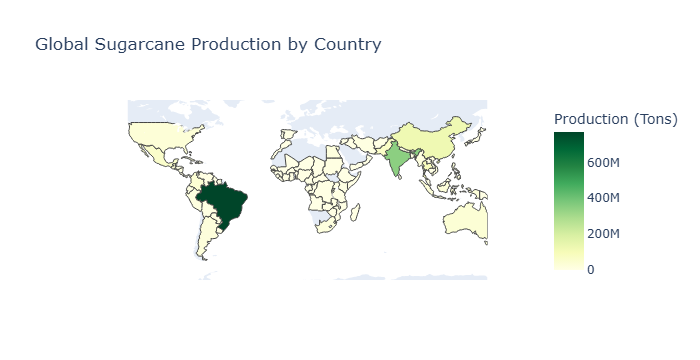

# Global Sugarcane Production - Exploratory Data Analysis (EDA)

This project dives into a detailed **Exploratory Data Analysis (EDA)** of sugarcane production across different countries and continents.  
The aim is to extract meaningful insights from raw data — uncovering patterns in yield, acreage, and production volume.

## 📊 Overview

The goal is to explore:
- Which countries produce the most sugarcane?
- What’s the yield efficiency per hectare?
- Acreage vs production correlation
- Continent-wise contributions
- Outliers in yield or land use
- Distribution using **Pandas Profiling** and **Choropleth Map**

## 📁 Dataset Info

- **Source**: [Kaggle – List of Countries by Sugarcane Production](https://www.kaggle.com/)
- **File Used**: `List of Countries by Sugarcane Production.csv`
- **Records**: 103 countries
- **Fields**: Country, Continent, Production, Acreage, Yield, Production per Person

## 🛠️ Tools & Libraries

- `pandas` – data cleaning  
- `matplotlib`, `seaborn`, `plotly.express` – visualizations  
- `pandas_profiling` – automated report  
- `plotly choropleth` – world map visualization

## 🔍 Key Analysis Performed

### ✅ Data Cleaning
- Removed null/missing values
- Converted numbers from strings with commas
- Normalized column names
- Casted to proper data types

### 📈 Univariate & Bivariate Analysis
- Continent-wise distribution (bar plot)
- Histograms for yield, acreage, production
- Boxplots for outlier detection
- Top 10 producers chart
- Yield vs acreage patterns

### 📊 Pandas Profiling
- Summary report including:
  - Missing values
  - Distribution shapes
  - Correlation matrix
  - Warnings and duplicates
    
### 🌎 Choropleth Map
- Created global map showing country-wise production in color-coded intensity.

_This interactive map shows country-wise sugarcane production using color-coded intensities._

**Note:** Due to GitHub's static rendering, interactive visualizations (e.g. Choropleth Map & Pandas Profiling) may not be displayed.  

## 📁 Files Included

| File Name                                | Description                              |
|-----------------------------------------|------------------------------------------|
| `Sugarcane_EDA.ipynb`                   | Main analysis notebook with plots        |
| `List of Countries by Sugarcane Production.csv` | Raw dataset                     |
| `README.md`                             | You’re reading it!                       |

## 📎 License & Attribution

This project has been developed as part of my learning journey in Data Science and Exploratory Data Analysis.

However, some ideas have been **partially inspired** by:
- 📘 [GeeksforGeeks Data Science & ML Course](https://www.geeksforgeeks.org/)

External ideas were reinterpreted and implemented in my own style and understanding.  
This repository is created purely for educational and non-commercial purposes, and to demonstrate my growing skills in data analysis and presentation.

---

## 👨‍💻 Created By

**Rishu Sharma**  
B.Tech CSE (Data Science) Student
